# 什么是langchain

langchain是一个开发llm相关业务功能的集大成者，是一个python的第三方库，提供各种功能api。

* 提示词优化api
* 调用各类模型的api
* 会话记忆相关功能的api
* 各类文档管理分析功能的api
* agent智能体构建相关api
* 各类功能链式执行的能力

# langchain的安装

根据不同需求，安装不同的包，包括核心包langchain，各类接口支持的包如：langchain-ollama等

```bash
pip install
```

# RAG介绍

通用大模型存在以下问题：

* 大模型知识并非实时
* 大模型领域知识有限
* 幻觉问题
* 数据安全性

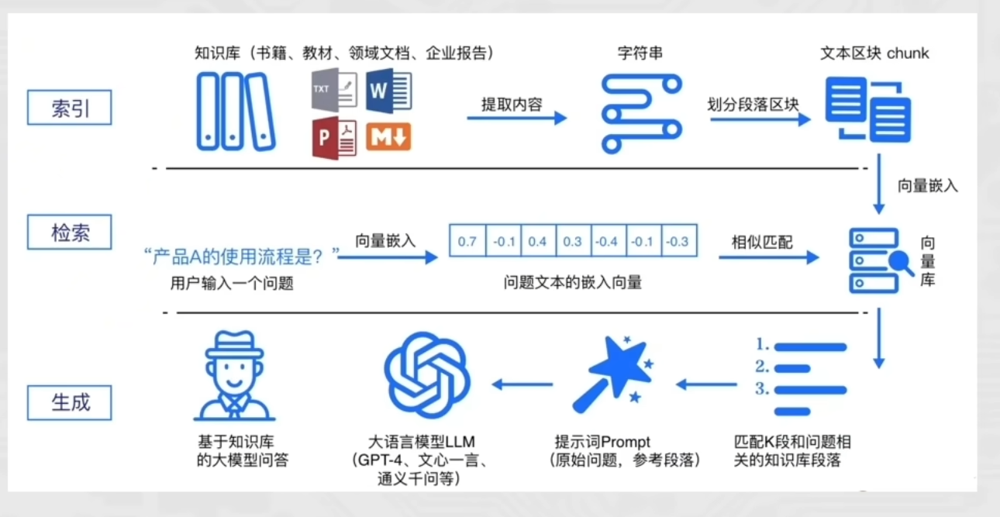

RAG，即增强内容生成，由图片我们可以知道，RAG主要完成的工作是给大模型外挂知识库，大模型通过rag知识库的检索，并且优化这个过程，从而让大模型给出更加精准的答案。

RAG标准流程由索引、检索和生成三个核心环节组成。

* 索引阶段：包括加载文件，内容提取，文本分割，文本向量化存入向量数据库
* 检索阶段：query向量化并在文本向量中匹配出于问句相似的top_k个
* 生成阶段：匹配出的文本作为上下文和问题一起添加到prompt当中，提交给llm生成答案。

# langchain调用大模型介绍

1、通过模型sdk调用大模型api

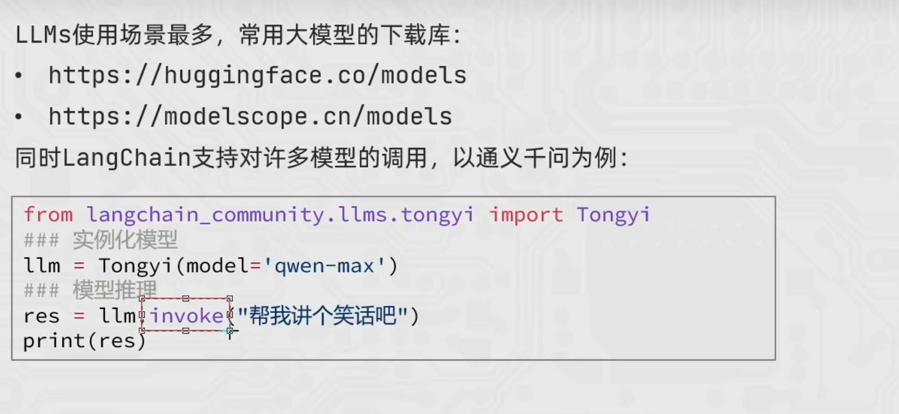

2、调用本地大模型

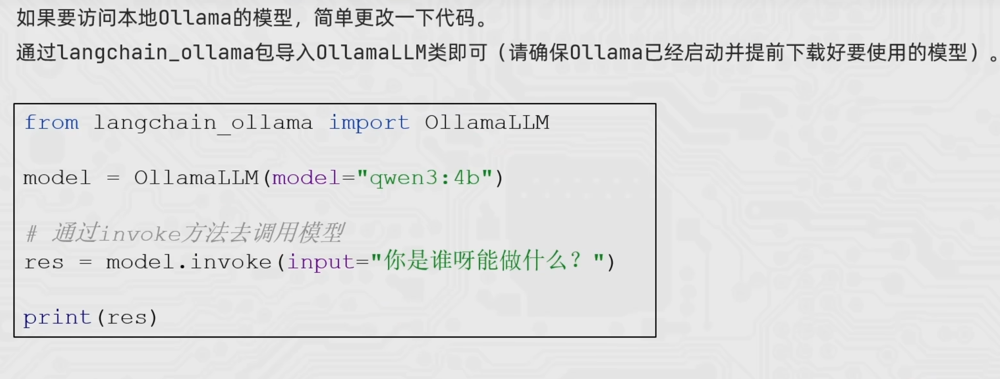

# langchain流式输出介绍

为了缓解用户等待焦虑，我们通常使用流式输出的方式，输出大模型的回答。

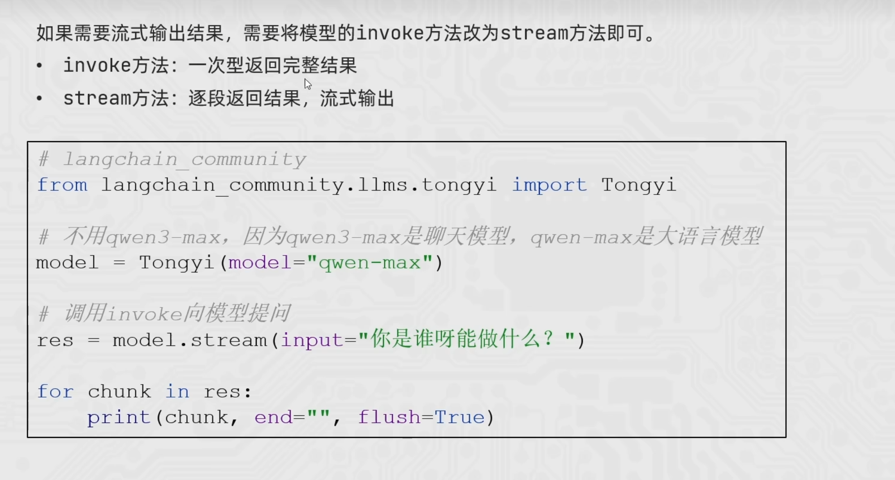

# langchain调用聊天模型

**聊天大模型的调用可以为模型定制角色和角色专用提示词，下方以阿里的接口示例。**

1、用户提示词

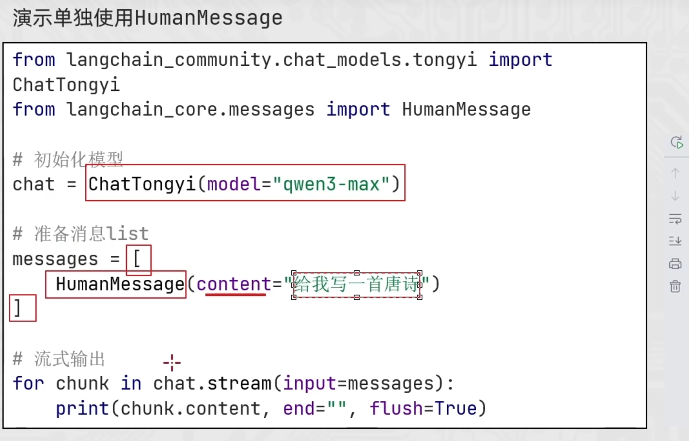

2、系统提示词

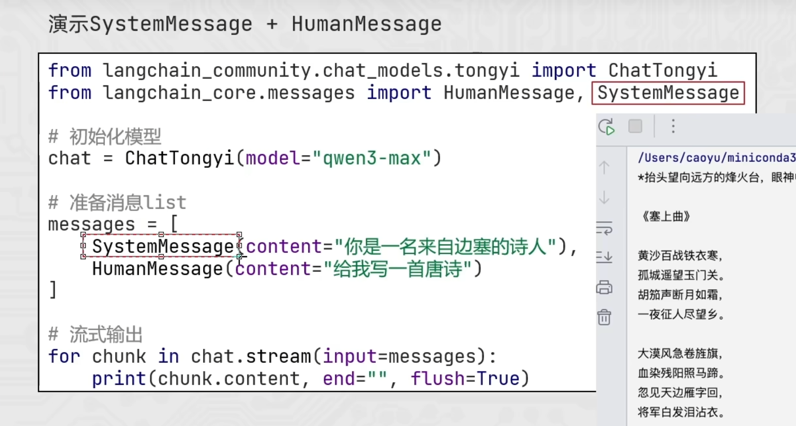

# langchain调用嵌入模型

在rag的过程中，需要将文本内容转为向量内容并存入向量数据库，此时则需要接入嵌入模型。

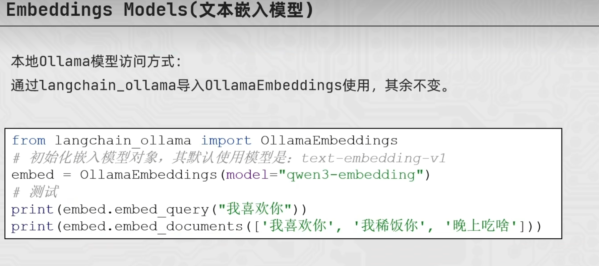

嵌入模型将数据转化成向量，当用户搜索的时候能够通过向量进行匹配。

# 借助langchain优化提示词

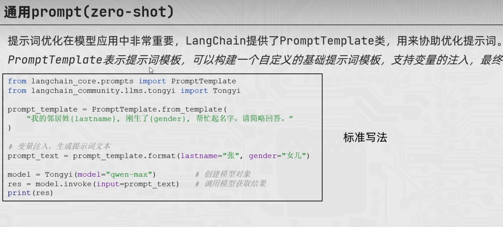

这里引入了一个叫做zero-shot的概念，即提示词优化的一种形式，零样本模式——ai生成内容和格式依赖内部的训练结果，对应还有一个few-shot模式，即将输出以样例的形式给出，让ai按照样例的模板输出。

# chain的基础使用

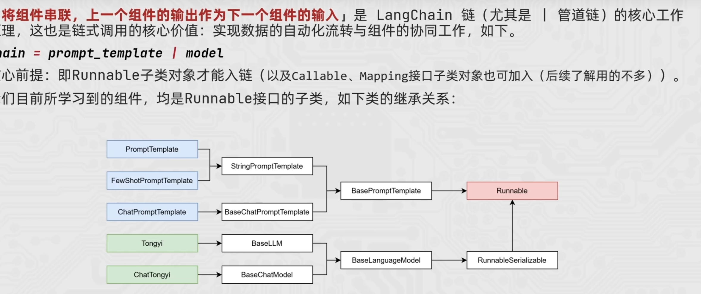

| 的这种形式是通过重载or方法的形式实现的，这也是chain的核心实现之一，注意链条前后的输入一致，前面部分的输出为后面部分的输入。在使用的时候可以利用paser作为中间件，参与链条的构建，下面以tongyi 大模型调用sdk为例：

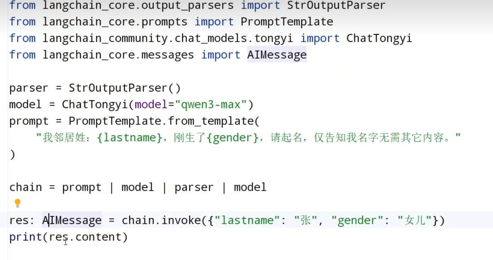

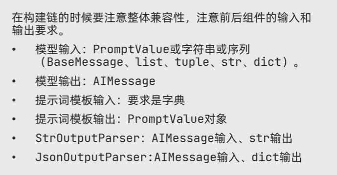


# langchain的记忆功能

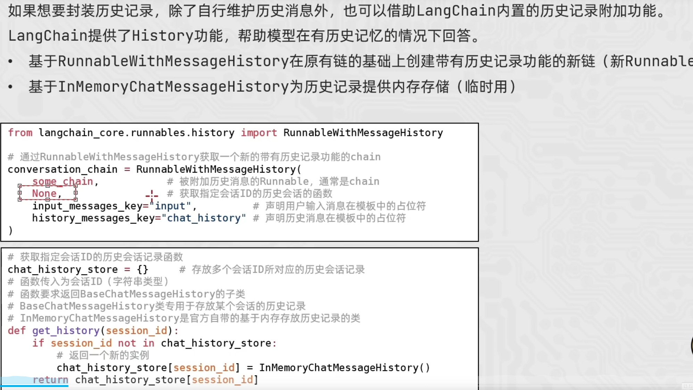

以上举例中的记忆功能只是端起的记忆，如果需要也可以引入长期记忆功能。

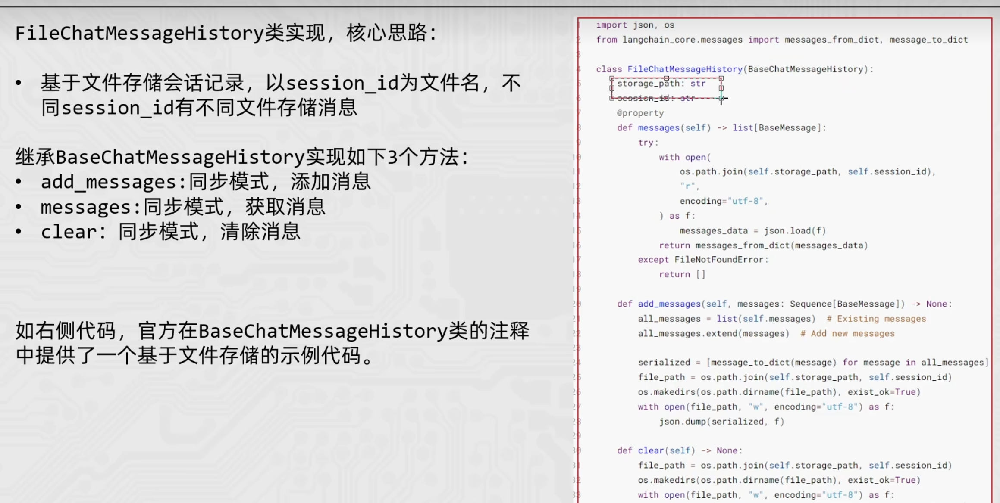

# 知识库文本处理工具

## 1、文档加载器

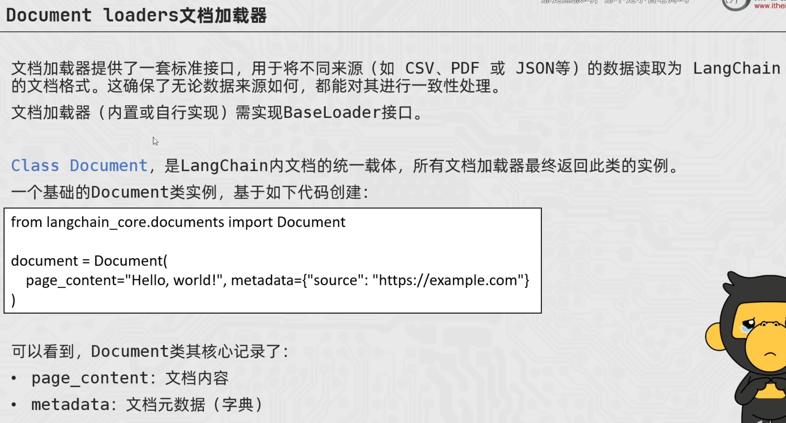

## 2、文档分割器

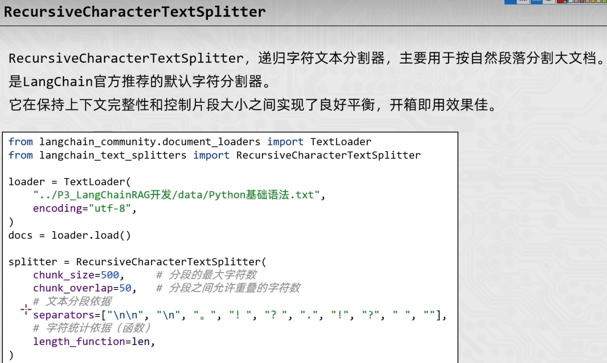

## 3、向量存储和检索

向量存储

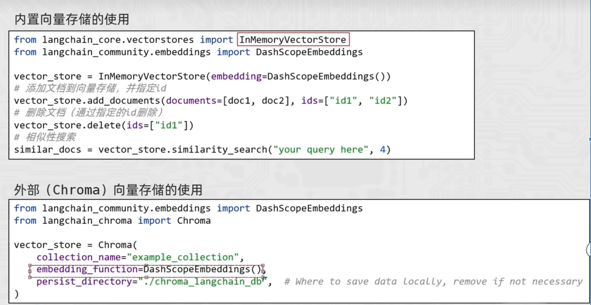

向量检索

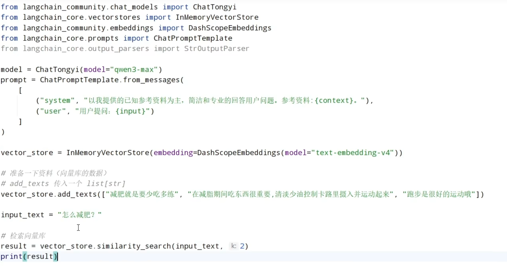
